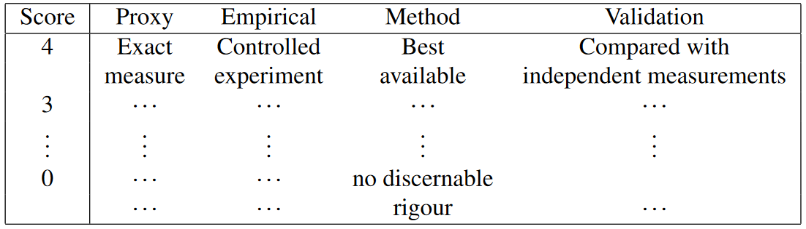

# The importance of uncertainty: assessment and quantification {#uncertainty}

This chapter contains a discussion of uncertainty, both in terms of statistical modelling and quantification, but also in the wider setting of sources of uncertainty outside those normally encountered in statistics. From this chapter, the reader will have gained an understanding of the following topics:

- Uncertainty can be dichotomized as either qualitative or quantitative, with the former allowing consideration of a wide variety of sources of uncertainty that would be difficult, if not impossible, to quantify mathematically.
- Quantitative uncertainty can be thought of as comprising both aleatory and epistemic components, the former representing stochastic uncertainty and the latter subjective uncertainty.
- Methods for assessing uncertainty including eliciting prior information from experts and sensitivity analysis.
- Indexing quantitative uncertainty using the variance and entropy of the distribution of a random quantity.
- Uncertainty in post-normal science derives from a wide variety of issues and can lead to high levels of that uncertainty with serious consequences. Understanding uncertainty is therefore a vital feature of modern environmental epidemiology.

## Supplementary Material {-}
### More on qualitative uncertainty {-}

The NUSAP matrix consists of five columns, each of which represents one of five generic assessment criteria \citep{vanderwal2000}. The first three of these refer mainly to quantitative elements involved in generating the
knowledge base: (i) numerical; (ii) units and (ii) spread. The latter two primarily represent qualitative uncertainty: (iv) assessment and (v) pedigree. Each row of the matrix contains the basic objects involved in the uncertainty analysis. Entries under (i) numerical might for example, the relative risk associated with short–term changes in air pollution for instance with the appropriate units given in (ii) the unit column. Spread is a measure of uncertainty in an estimate or prediction for the quantity defined in columns (i) and (ii) \citep{funtowicz1990}, and in the air pollution example might be the standard error or confidence interval associated with the risk estimate. Columns (i), (ii) and (iii) therefore capture the information that is available from standard statistical approaches.

The final two columns act as an aid to recording this more general uncertainty with entries in the (iv) assessment column usually be a numerical quantity summarizing the result of a pedigree analysis. This pedigree analysis would consist of an organized discussion amongst experts, possibly from a wide variety of subject areas and interests, charged with determining the uncertainty in the relevant knowledge base related to the overall objectives of the analysis.

:::: {.blackbox data-latex=""}
::: {.center data-latex=""}
**Example S.1: The health impact of VOCs**
:::

The NUSAP matrix would be designed created to fit the specific context and process component being assessed, for example the quality of the data or the quality of a complex model. Here we will focus on the pedigree and assessment in an example of the health impact of VOCS. We concentrate on the pedigree analysis and show how the example of
such a consultation can itself be expressed as a pedigree matrix. 

Based on interest in emissions of volatile organic compound (VOC) emissions from paint, a study was undertaken to assess the uncertainties associated with annual emissions in the Netherlands, \citep{sluijs2005}. As part of this study a pedigree matrix was
used in order to allow qualitative uncertainties to be incorporated into the assessment of monitoring data. An abbreviated version of the pedigree matrix \citep{sluijs2005} appears in **Table 1** which shows how scores are to be assigned by experts according to four different pedigree criteria when considering a particular type of paint. In this case, ‘Proxy’ might relate to inference of VOC emissions based on national paint sales, ‘Empirical’ to the degree to which direct measurements were used for the assessment, ‘Method’ to methodological rigour in making the measurements and ‘validation’ the comparison between measurements over a long time frame.

Differences in emissions will arise from the different uses of paint, which can be classified into five categories including SHI for ship construction and DIY for do–it–yourself (DIY) construction. There will also be variations based on whether paint is produced locally or imported. In addition, thinner which is added to the paint is also a source of emissions and will thus lead to differences in emissions. This would lead to four emission estimates for each class for which for SHI and DIY have an annual VOC totals for 1998 of 2.4 and 11.3 ktonnes respectively with the total across the five classes being 32.2 ktonnes of emissions from paint purchased nationally. The overall sum of annual VOC emission for both national and imported paints is 51.6 ktonnes.

However the components of these total emissions are found in a variety of ways and some will be more certain than others and here the pedigree analysis can help in assessing the relative uncertainties and how they might combine in the aggregation. For example, calculations made on national sales data of VOC emissions for paint resulting in an estimate of 6.6 ktonnes. In this case a uncertainty score of 4 was assigned for Method reflecting the relative robustness of this approach. In contrast the estimate of the proportion of paint that had thinner added, 28%, in DIY construction was imputed rather than measured and was scored only 2 for Method since the value was considered to be no more than an educated guess.

Such an analysis was done for each each source of VOCs for a total of fifteen pedigree analyses on each of the four pedigree criteria above. There were only fifteen and not 5 × 4 = 20 since ten of the twenty fell into into just six categories. The result was a 15 × 4 (pedigree) matrix with a number between 0 and 4 appearing in each cell. Expressing the row columns as a percentage of the maximum value of 16 gives a measure of the overall strength of evidence for each the categories \citep{vanAsselt2000}. In this analysis, National-DIY category got the highest score of 0.8 with the National-SHI getting a lower score of 0.7. 

The results led to a number of conclusions. For example the assumed VOC percentage for imported paint had one of the two weakest uncertainty assessments pointing to a lack of requisite knowledge and the need for improvements in the way these VOC emissions are assessed.

Diagnostic analyses of the scores are also possible. The diagnostic diagram is one tool for doing this. It aims to compare qualitative and quantitative uncertainties in a search for discrepancies. More precisely, it plots sensitivity to inputs against strengths. Each input parameter was randomly varied around its specified value, independently of the other parameters, and for each simulation the contribution of the component VOC’s contribution to a paint class’s total VOC was determined. It was found that the contribution from the imported VOC percentage was by far the greatest at 82.0%. When plotted against its strength score of 0.3, it indicated a strong outlier and singled out this component as needing further information and analysis. Overall the NUSAP analysis led to a number of important insights into the paint monitoring program.

```{r Table 1, fig.cap= "The pedigree matrix for the VOC data. It gives the scoring criteria based on evaluators’ assessments with respect to the various criteria.", out.width = "100%", echo=FALSE}


```


::::


